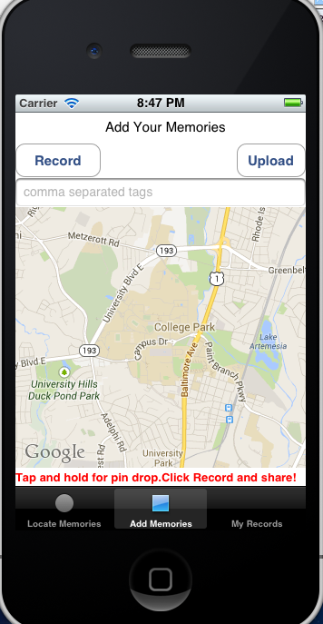

# iRememberUMD

This is an iPhone application that allows former students to upload an audio memory of an event while they were a student on campus.  A pin can be dropped on the map to 
geolocate where this memory happend.  

